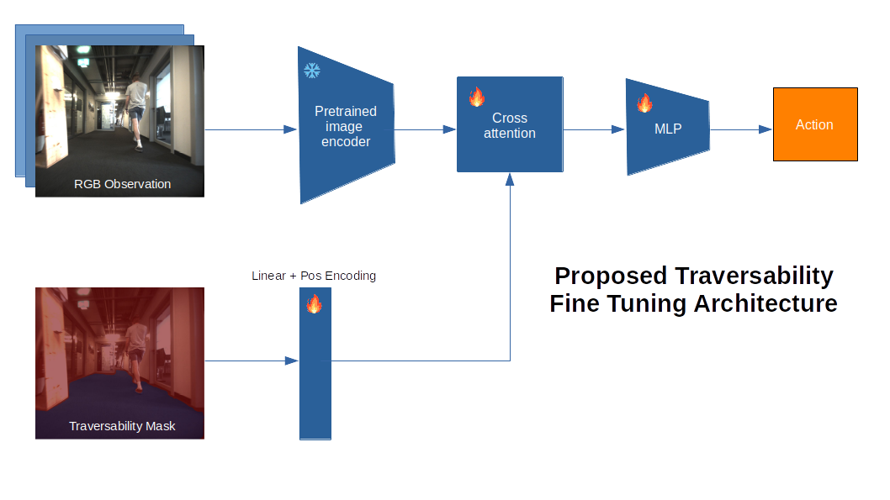

## Visual Navigation Using Traversability Priors
Includes:
- A pl module for semantic segmentation fine tuning using a faster-vit backbone and fpn head
- A pl module for behavioral cloning training on image state spaces

